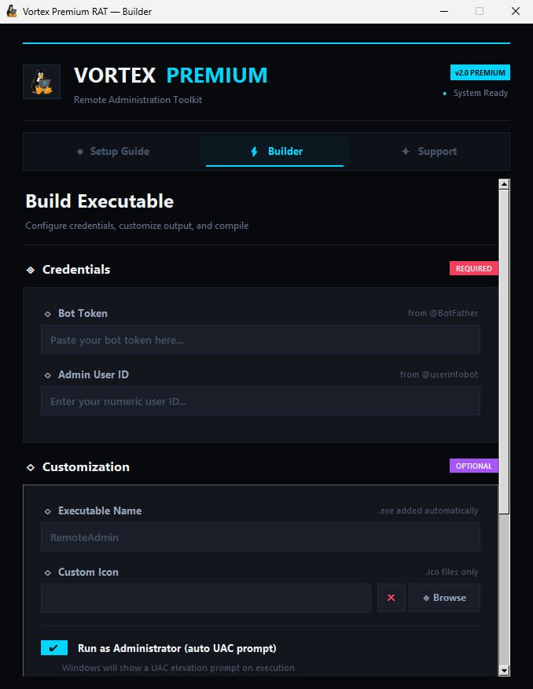
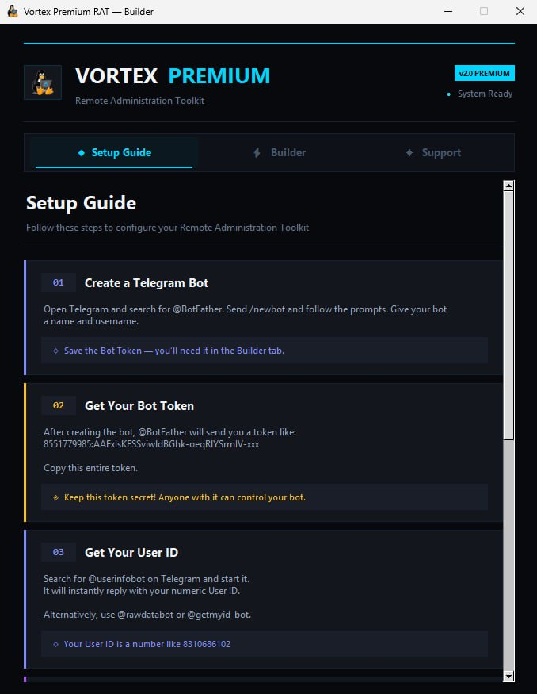
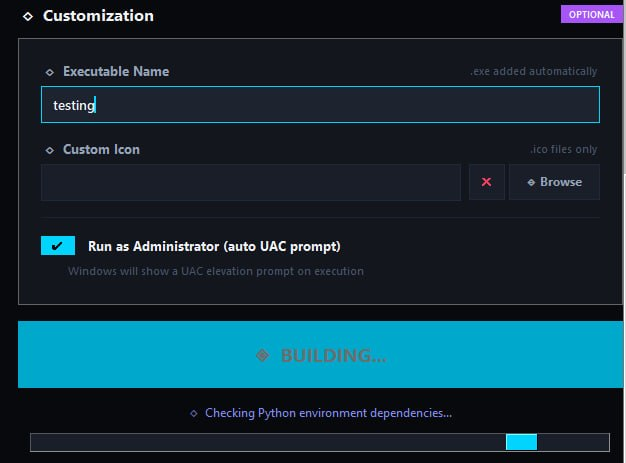
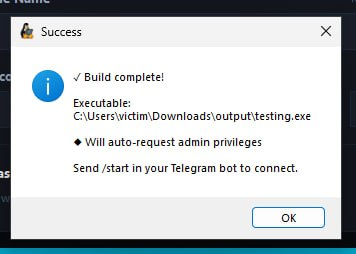
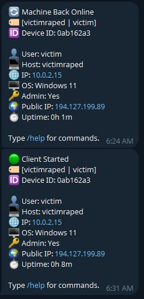

# Vortex RAT Builder

Vortex RAT Builder is a professional, open-source builder project for authorized device management, security research, and controlled lab testing. It combines a polished Windows builder UI with Telegram bot configuration, making it easier to configure, package, and manage authorized remote administration builds from one place.

Official website: [vortexcodes.org](https://vortexcodes.org)

> Important: Vortex RAT Builder must only be used for systems you own or have explicit permission to administer. Do not install, run, monitor, or collect data from any device without clear authorization.

## Project Status

- Fully open source for transparency, learning, review, and customization.
- Built around a Telegram bot workflow for authorized remote administration builds.
- Includes a modern Windows builder interface with setup, build, and support sections.
- Designed for authorized administrators, developers, and security researchers.

## Pricing

| Plan | Price | Includes |
| --- | ---: | --- |
| Lifetime Access | $30 one time | Project access, premium support, updates, and community access |
| Future Paid Updates | 30% off | Existing buyers receive a 30% discount on future paid upgrade packages or premium add-ons |

The source is open for review and learning. The paid lifetime option supports active development, support, packaged releases, and future maintenance.

## Buy And Support

To buy Vortex RAT Builder or request support:

- Direct message: [t.me/highoncodes](https://t.me/highoncodes)
- Support and update channel: [t.me/VortexPremiumRat](https://t.me/VortexPremiumRat)
- Website: [vortexcodes.org](https://vortexcodes.org)

## Screenshots

The screenshots below show the main Vortex RAT Builder workflow: setup guidance, build configuration, packaging progress, and build completion.

### Builder Configuration



The Builder tab is where users enter their Telegram bot token, admin user ID, executable name, optional icon, and administrator prompt preference before packaging a build.

### Setup Guide



The Setup Guide explains the first-time configuration flow, including creating a Telegram bot, saving the bot token, and finding the admin Telegram user ID used for access control.

### Build Progress



The build screen shows the selected executable name, optional administrator prompt setting, dependency checks, and packaging progress while the builder prepares the output.

### Build Complete



After a successful build, Vortex RAT Builder shows the output executable path and reminds the user to connect through the configured Telegram bot.

### Telegram Status Updates



When an authorized build connects, the configured Telegram admin receives a status card with device context such as user, host, OS, admin state, IP details, and uptime.

### Command Preview

The Telegram `/help` menu organizes commands by category inside the bot. For a public-safe command list with usage examples, see the full [Command Reference](#command-reference) section below. Sensitive command-menu screenshots are intentionally not embedded in this README because they expose high-risk actions that should only be handled in private authorized lab documentation.

## Core Features

### Telegram-Based Control

Vortex RAT Builder configures builds that use Telegram as the command and notification layer. Authorized admins can manage connected devices, receive startup notifications, switch between active sessions, and keep track of online machines through a simple chat-based workflow.

Highlights:

- Admin-only access control using a configured Telegram user ID.
- Multi-device session handling.
- Device registration and online status tracking.
- Session switching for managing several authorized machines.
- Startup notification when an authorized device comes online.

### Modern Builder UI

The included builder provides a clean desktop interface for preparing Vortex RAT Builder builds without manually editing configuration values.

Highlights:

- Midnight-style dark interface.
- Setup guide, builder, and support pages.
- Telegram bot token and admin ID configuration.
- Custom executable name support.
- Optional custom Windows icon support.
- Optional administrator privilege request during build.
- Dependency checks before packaging.
- PyInstaller-based standalone executable creation.
- Built-in Telegram support buttons.

### System Administration

Vortex RAT Builder packages a broad set of system management tools for authorized Windows administration.

Highlights:

- Full system information reporting.
- Admin/elevation status checks.
- Current user and date/time information.
- CPU, RAM, OS, uptime, and hardware overview.
- Process listing and process termination.
- Installed software inventory.
- Windows service listing.
- Idle time reporting.
- Lock, sleep, shutdown, restart, and logoff actions.

### File Management

The file management module helps administrators inspect, organize, and transfer files on authorized devices.

Highlights:

- View and change the current working directory.
- List folder contents.
- Show mounted drives.
- Search for files by name.
- Upload and download files.
- Download files from a URL to the authorized device.
- Copy, move, rename, delete, and open files.
- Create folders.
- Encrypt and decrypt files with a provided key.

### User Interaction Tools

Vortex RAT Builder can package tools for visible interaction with an authorized device during support, testing, or demonstration sessions.

Highlights:

- Display message dialogs.
- Show custom error dialogs.
- Use text-to-speech output.
- Type provided text into the active session.
- Open websites in the default browser.
- Change the desktop wallpaper.
- Play audio files.
- Control volume and mute state.
- Turn monitors off.
- Hide or show the taskbar and desktop icons.
- Swap and restore mouse button behavior.

### Capture And Monitoring

For consent-based support, diagnostics, and lab testing, Vortex RAT Builder can package capture and monitoring utilities.

Highlights:

- Capture screenshots.
- Read and set clipboard text.
- List connected cameras.
- Select a camera index.
- Capture webcam images.
- Record microphone audio for a chosen duration.
- Start and stop keyboard activity logging for authorized audit sessions.

These features handle sensitive user information and should only be used with clear consent.

### Security Audit And Recovery Modules

Vortex RAT Builder includes optional data-audit modules intended for controlled environments, account recovery testing, and authorized security review.

Highlights:

- Browser credential audit support.
- Cookie/session inventory support.
- Public IP and geolocation lookup.
- Discord token audit support.
- Roblox account/session audit support.
- Steam account/session audit support.
- Environment variable listing.

Only use these modules on accounts, browsers, and devices you own or are explicitly authorized to inspect.

### Network Utilities

The network module helps inspect connectivity and local Windows network state.

Highlights:

- Nearby Wi-Fi network listing.
- Saved Wi-Fi profile review.
- Local IP configuration output.
- Active connection listing.
- Hosts-file based site block and unblock support.

### Advanced Windows Controls

Vortex RAT Builder also includes advanced Windows control features for lab testing and administrator-controlled environments.

Highlights:

- Startup entry management.
- Task Manager enable/disable controls.
- Windows Defender enable/disable controls.
- Windows Firewall enable/disable controls.
- Controlled blue screen test action.
- Critical-process test mode.
- Device registry reset for Vortex session tracking.

These options can affect system stability and security. Use them only in isolated labs or on machines where you have permission and a recovery plan.

## Project Files

| File | Purpose |
| --- | --- |
| `builder.py` | Desktop builder UI for configuring and packaging Vortex RAT Builder builds. |
| `client.py` | Build template/client logic and Telegram command handler. |
| `requirements.txt` | Python dependencies used by the builder and client. |
| `icon.ico` | Default Windows icon used by the project. |

## Requirements

- Windows environment for full feature support.
- Python 3.8 or newer.
- Telegram bot token.
- Telegram admin user ID.
- Dependencies listed in `requirements.txt`.

Install dependencies:

```bash
pip install -r requirements.txt
```

Run the builder:

```bash
python builder.py
```

## Command Reference

Send `/help` to the configured Telegram bot after an authorized device connects to see the in-app command list.

The commands below are documented for authorized administration, support, and lab use. Commands that collect credentials, capture private activity, create persistence, disable security tools, or deliberately destabilize a machine are intentionally not documented with usage instructions in this public README.

### Complete Command Inventory

```text
System:
/shell
/admincheck
/sysinfo
/whoami
/datetime
/shutdown
/restart
/logoff
/lock
/sleep
/listprocess
/prockill
/idletime
/installed
/services
/startup
/rmstartup
/devices

Files:
/cd
/dir
/currentdir
/download
/upload
/uploadlink
/delete
/drives
/search
/encrypt
/decrypt
/copy
/move
/rename
/mkdir
/openfile

Interaction:
/message
/fakeerror
/voice
/write
/wallpaper
/website
/audio
/popup
/volumeup
/volumedown
/mute
/monitors_off

Capture:
/screenshot
/clipboard
/setclipboard
/getcams
/selectcam
/webcampic
/record
/keylog
/stopkeylog

Data Collection:
/cookies
/allcookies
/passwords
/geolocate
/tokens
/roblox
/steam

Network:
/wifilist
/wifipasswords
/ipconfig
/netstat
/env

Control:
/blocksite
/unblocksite
/disabletaskmgr
/enabletaskmgr
/disabledefender
/enabledefender
/disablefirewall
/enablefirewall
/hidetaskbar
/showtaskbar
/hidedesktop
/showdesktop
/swap_mouse
/unswap_mouse
/bluescreen
/critproc
/switch
/clearregistry

General:
/exit
```

### General

| Command | Usage | Description |
| --- | --- | --- |
| `/start` | `/start` | Confirm that the authorized device is connected. |
| `/help` | `/help` | Show the command list inside Telegram. |
| `/exit` | `/exit` | Stop the running client process. |

### Device Sessions

| Command | Usage | Description |
| --- | --- | --- |
| `/devices` | `/devices` | List online authorized devices registered to the bot. |
| `/switch` | `/switch <session_number>` | Switch control to another connected authorized session. |
| `/clearregistry` | `/clearregistry` | Reset the local Vortex session registry used for device tracking. |

### System Information

| Command | Usage | Description |
| --- | --- | --- |
| `/admincheck` | `/admincheck` | Check whether the client is running with administrator privileges. |
| `/sysinfo` | `/sysinfo` | Display detailed system, hardware, OS, and usage information. |
| `/whoami` | `/whoami` | Show the current Windows user context. |
| `/datetime` | `/datetime` | Show the device date and time. |
| `/idletime` | `/idletime` | Show how long the user session has been idle. |
| `/listprocess` | `/listprocess` | List running processes. |
| `/prockill` | `/prockill <process_name>` | Terminate a named process on an authorized device. |
| `/installed` | `/installed` | List installed programs. |
| `/services` | `/services` | List Windows services and their status. |

### Power And Session Control

| Command | Usage | Description |
| --- | --- | --- |
| `/lock` | `/lock` | Lock the workstation. |
| `/sleep` | `/sleep` | Put the machine into sleep mode. |
| `/shutdown` | `/shutdown` | Shut down the machine. |
| `/restart` | `/restart` | Restart the machine. |
| `/logoff` | `/logoff` | Log off the active Windows session. |

### File Management

| Command | Usage | Description |
| --- | --- | --- |
| `/currentdir` | `/currentdir` | Show the current working directory. |
| `/cd` | `/cd <path>` | Change the current working directory. |
| `/dir` | `/dir` | List files and folders in the current directory. |
| `/drives` | `/drives` | List mounted drives. |
| `/search` | `/search <name>` | Search for files matching a name. |
| `/download` | `/download <file_path>` | Send an authorized file from the device to Telegram. |
| `/upload` | Attach a file with caption `/upload` | Save an attached Telegram file to the current directory. |
| `/uploadlink` | `/uploadlink <url> <file_name>` | Download a file from a URL to the authorized device. |
| `/copy` | `/copy <source> <destination>` | Copy a file. |
| `/move` | `/move <source> <destination>` | Move a file. |
| `/rename` | `/rename <old_path> <new_path>` | Rename a file or folder. |
| `/mkdir` | `/mkdir <path>` | Create a folder. |
| `/openfile` | `/openfile <path>` | Open a file with the default Windows handler. |
| `/delete` | `/delete <path>` | Delete a file or folder on an authorized device. |
| `/encrypt` | `/encrypt <file_path> <key>` | Encrypt a selected file with the provided key. |
| `/decrypt` | `/decrypt <file_path> <key>` | Decrypt a selected file with the provided key. |

### User Interaction

| Command | Usage | Description |
| --- | --- | --- |
| `/message` | `/message <text>` | Display a message box. |
| `/fakeerror` | `/fakeerror <text>` | Display a custom error dialog for testing. |
| `/voice` | `/voice <text>` | Speak text using text-to-speech. |
| `/write` | `/write <text>` | Type text into the active session. |
| `/wallpaper` | Attach an image with caption `/wallpaper` | Set the attached image as the desktop wallpaper. |
| `/website` | `/website <url>` | Open a URL in the default browser. |
| `/audio` | Attach audio with caption `/audio` | Play the attached audio file. |
| `/popup` | `/popup <count> <text>` | Show repeated popup messages for authorized testing. |
| `/volumeup` | `/volumeup` | Increase system volume. |
| `/volumedown` | `/volumedown` | Decrease system volume. |
| `/mute` | `/mute` | Toggle mute. |
| `/monitors_off` | `/monitors_off` | Turn off connected monitors. |

### Capture And Diagnostics

| Command | Usage | Description |
| --- | --- | --- |
| `/screenshot` | `/screenshot` | Capture the current screen. |
| `/clipboard` | `/clipboard` | Show clipboard text. |
| `/setclipboard` | `/setclipboard <text>` | Set clipboard text. |
| `/getcams` | `/getcams` | List available camera indexes. |
| `/selectcam` | `/selectcam <index>` | Select which camera index to use. |
| `/webcampic` | `/webcampic` | Capture an image from the selected camera with consent. |
| `/record` | `/record <seconds>` | Record microphone audio for a limited duration with consent. |

### Network Diagnostics

| Command | Usage | Description |
| --- | --- | --- |
| `/wifilist` | `/wifilist` | List nearby Wi-Fi network names. |
| `/ipconfig` | `/ipconfig` | Show local network adapter configuration. |
| `/netstat` | `/netstat` | Show active network connections. |
| `/env` | `/env` | Show environment variables for diagnostics. |
| `/geolocate` | `/geolocate` | Show public IP geolocation information. |
| `/blocksite` | `/blocksite <domain>` | Add a domain block entry on an authorized system. |
| `/unblocksite` | `/unblocksite <domain>` | Remove a domain block entry on an authorized system. |

### Desktop Visibility

| Command | Usage | Description |
| --- | --- | --- |
| `/hidetaskbar` | `/hidetaskbar` | Hide the Windows taskbar. |
| `/showtaskbar` | `/showtaskbar` | Show the Windows taskbar. |
| `/hidedesktop` | `/hidedesktop` | Hide desktop icons. |
| `/showdesktop` | `/showdesktop` | Show desktop icons. |
| `/swap_mouse` | `/swap_mouse` | Swap left and right mouse buttons. |
| `/unswap_mouse` | `/unswap_mouse` | Restore normal mouse button behavior. |

### Sensitive Commands

The codebase contains additional high-risk commands related to credential/session collection, keyboard logging, startup persistence, security-control changes, and crash/critical-process testing. Because those capabilities can harm users when misused, this README does not provide operational usage instructions for them. Only use or document those modules in private, authorized lab environments, and remove them before publishing a public build.

## Responsible Use

Vortex RAT Builder is a powerful administration builder. By using it, you agree to the following rules:

- Use it only on devices you own or have explicit permission to manage.
- Do not use it for unauthorized access, surveillance, credential theft, harassment, or evasion.
- Do not deploy it silently or deceptively.
- Tell users what is being installed, what it can access, and how it can be removed.
- Follow all laws and platform rules in your country or region.

The author and contributors are not responsible for misuse, damage, illegal activity, or policy violations caused by this software.

## Support

For help, updates, custom requests, or purchase questions:

- DM: [t.me/highoncodes](https://t.me/highoncodes)
- Channel: [t.me/VortexPremiumRat](https://t.me/VortexPremiumRat)
- Website: [vortexcodes.org](https://vortexcodes.org)

Thank you for supporting Vortex RAT Builder and the Vortex Codes community.
